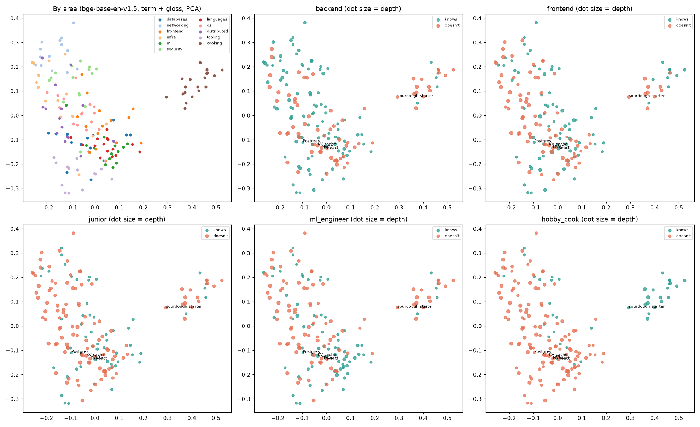

# PR-34: knowledge-map familiarity — embeddings vs Jev

**Ticket:** [PR-34](https://linear.app/freddie-cassidy/issue/PR-34/spike-knowledge-map-familiarity-embeddings-vs-jev) (related: [PR-13](https://linear.app/freddie-cassidy/issue/PR-13))
**Date:** 2026-09-26
**Context:** layer 4 ("familiarity for *this* person") of the proposed detector funnel in
[`docs/handover-20260926-detector-rethink.md`](../../docs/handover-20260926-detector-rethink.md)
(committed on `origin/claude/dazzling-feynman-ojfon5`).

## Question

Given the concepts we already know a person knows or doesn't know, can we predict whether they
know a *new* concept? In particular, how do embedding proximity and Jev compare on the
"Postgres vs MVCC" case: the two sit close in embedding space, but knowing Postgres doesn't mean
you know MVCC?

## Answer, in short

- **Embeddings capture *area* and miss *depth*, as the handover predicted.** kNN over
  term + gloss embeddings gets 96–98% right when a person knows all of an area or none of it.
  In the areas where the person knows some but not all, it barely beats chance: boundary AUC
  0.72, and 53% right on the concepts they do know there.
- **Jev ranks best by a wide margin:** AUC 0.91 overall and 0.89 in boundary areas, against
  0.72–0.79 for any embedding method. It is the only method that separates depth.
- **But Jev is pessimistic.** At a 0.5 cut it says "does not know" to almost everything
  borderline: only 24% right on concepts in fully known areas. Learning the cut from the
  person's own map fixes most of this, taking accuracy from 0.69 to 0.82 at the same AUC.
  In the product, that cut is the "threshold learned from dismissals" the funnel already
  plans. Dropping the "knowing a neighbour isn't knowing this" sentence from the question
  only partly reduces the bias (accuracy 0.73), so most of it comes from Jev, not the
  wording.
- **A large share of Jev's depth sense needs no personal map at all.** Jev asked only "would a
  typical developer know this?" already scores 0.84 AUC in boundary areas. The map adds the
  *area* signal (0.77 → 0.91 overall). Read the caveat below before trusting this: the depth
  labels were written by an LLM, so an LLM's sense of "advanced" matching them is partly
  circular.
- **Always embed term + gloss, not the bare term.** With glosses, clustering splits software
  from cooking perfectly (ARI 1.00 for both models). With bare terms it doesn't split them at
  all (ARI 0.06 and −0.03). This confirms decision 8 in the handover. Areas *within* software
  only partly emerge (ARI 0.31–0.40 against 11 areas), so expect domain-level clusters and
  not fine areas.
- **A chat LLM given the same prompt does worse than Jev and is far slower.** `inclusionai/ling-3.0-flash` at low reasoning effort, run on one seed: AUC 0.82 (0.81 in boundary areas), a median of 7.2 s and $0.00009 per prediction, against Jev's 0.91, 0.29 s and $0.00006. It is less pessimistic than Jev, but it misses the MVCC-style case more often (45% right on concepts one step too deep).
- **Cost is not a concern:** Jev had a median of 0.29 s and $0.00006 per prediction with a
  68-concept map in the state. That cost grows with map size, though (see open gaps).

### Recommendation for layer 4

Use Jev for the verdict, and learn the cut-off per person from their dismissals rather than
using 0.5. Use embeddings (term + gloss) to *retrieve* the relevant part of the map to put in
Jev's state, and for domain clustering and the map view. Don't use them for the familiarity
verdict itself. kNN + commonness prior (AUC 0.82, free, offline) is the fallback when Jev is
unavailable.

## Results

5 seeds. In each seed, each of the 5 personas has a random 40% of the 170 concepts revealed as
their map (68 concepts), and the other 102 are predicted. Figures are mean ± sd over seeds, and
each seed pools all personas. The full tables, including per-persona AUC, are in
[`results.md`](results.md), with raw numbers in [`results.json`](results.json).

| Method | AUC (all) | AUC (boundary areas) | Accuracy |
|---|---|---|---|
| Commonness prior (wordfreq Zipf, cut learned on map) | 0.69 ± 0.02 | 0.73 ± 0.02 | 0.67 ± 0.02 |
| kNN, bare term (bge-base) | 0.76 ± 0.01 | 0.72 ± 0.02 | 0.68 ± 0.01 |
| kNN, term + gloss (bge-base) | 0.79 ± 0.01 | 0.72 ± 0.02 | 0.72 ± 0.01 |
| kNN, term + gloss (MiniLM) | 0.75 ± 0.02 | 0.68 ± 0.03 | 0.69 ± 0.02 |
| kNN + prior (logistic regression fitted on the map) | 0.82 ± 0.02 | 0.78 ± 0.02 | 0.75 ± 0.02 |
| Jev, no map ("typical developer") | 0.77 ± 0.01 | 0.84 ± 0.01 | 0.66 ± 0.01 |
| **Jev, with map** | **0.91 ± 0.01** | **0.89 ± 0.01** | 0.69 ± 0.02 |
| **Jev, with map, cut learned on map** | **0.91 ± 0.01** | **0.89 ± 0.01** | **0.82 ± 0.01** |
| Jev, with map, neutral wording | 0.91 ± 0.01 | 0.90 ± 0.02 | 0.73 ± 0.03 |
| Chat LLM, same prompt (`ling-3.0-flash`, reasoning low; **1 seed only**) | 0.82 | 0.81 | 0.72 |

*Boundary areas* are areas where the persona knows some concepts but not all, so area alone
can't give the answer and depth has to.

Accuracy by case: the Postgres→MVCC case is "one step too deep".

| Method | cold area | fully known area | boundary: known | boundary: one step too deep | boundary: 2+ too deep |
|---|---|---|---|---|---|
| kNN, term + gloss (bge-base) | 0.98 | 0.96 | 0.53 | 0.65 | 0.87 |
| kNN + prior | 0.93 | 0.90 | 0.65 | 0.66 | 0.86 |
| Jev, cut 0.5 | 0.99 | 0.24 | 0.24 | 0.99 | 1.00 |
| Jev, cut learned on map | 0.93 | 0.83 | 0.77 | 0.68 | 0.94 |

### The Postgres → MVCC probe itself

The backend persona knows databases to depth 2: Postgres and indexes, but not MVCC. Two maps
were used:

- **loo:** every other concept is revealed. This is easy, because MVCC's same-depth siblings
  (WAL, isolation levels) are in the map, labelled unknown, and sit right next to it.
- **shallow:** every database concept at depth 3 or deeper is also hidden, so the map shows
  Postgres and indexes as known and nothing deeper. This is the honest version of the
  question.

| Map | Concept | Truth | kNN gloss (bge) | Jev |
|---|---|---|---|---|
| loo | MVCC | doesn't | 0.21 | 0.03 |
| shallow | MVCC | doesn't | **0.50** | **0.14** |
| shallow | write skew | doesn't | 0.48 | 0.04 |
| loo | Postgres | knows | 0.90 | 0.45 |
| shallow (no database concepts at all) | Postgres | knows | 0.56 | 0.06 |

Once the nearby deeper concepts are hidden, kNN falls to a coin flip on MVCC, while Jev still
says no. The cost shows in the last two rows: Jev also doubts that a backend engineer knows
Postgres, which is the pessimism described above. The other probes (hydration, KV cache,
sourdough starter, git, …) are in `results.md`.

### The map



The first panel shows bge-base term + gloss embeddings, PCA to 2D, coloured by area. The other
panels colour each persona's known and unknown concepts, with dot size showing depth. Cooking
is its own island. The software areas overlap heavily in 2D, and known and unknown concepts are
interleaved inside them, which is the depth problem shown visually.

## What was verified, and what wasn't

**Verified empirically:**
- Everything in the tables was measured by `run.py` against Jev (`typesafe/jev-1.13`, served
  as `jev-1.13-20260917`) through OpenRouter's `/v1/systemone`, and against fastembed models
  run locally. It is reproducible from the caches in `.cache/`.

**Not verified, and the caveats that matter:**
- **The labels are synthetic.** A persona knows a concept if and only if its depth is at most
  the persona's level in that area. That rule is exactly the area-vs-depth structure being
  tested, and real knowledge is lumpier. These numbers are an upper bound on how clean the
  signal could be, not an estimate of real-world accuracy.
- **Circularity risk for the LLM-based methods.** The concepts, glosses, depth assignments and
  personas were all written by an LLM (Claude, in this session). A language model's sense of
  which concepts are "advanced" is likely to agree with them, which helps Jev and the chat LLM
  and doesn't help embeddings. The 0.84 AUC for "Jev, no map" is the warning sign. Depth labels
  written by Freddie, or real labels from PR-27, are needed before trusting the size of the
  gap.
- Only one Jev wording was tried, plus one neutral ablation. The order of items in the state
  (known first, then unknown, in dataset order) was never varied.
- The map in Jev's state was always 67–169 concepts. How cost, latency and accuracy behave with
  a real, growing map (hundreds of concepts) is untested.
- "Knows the name" and "understands it" (decision 8) are not separated here: the labels have
  only one notion of "knows".
- kNN used fixed hyperparameters (k = 7, softmax temperature 0.05) that were never tuned.

## How to run

Needs `OPENROUTER_API_KEY`, which is read from the repo-root `.env`.

```bash
cd spikes/20260926-PR-34-knowledge-map-familiarity
uv sync
uv run run.py                    # all methods except the chat LLM (~$0.45 from cold, $0 from cache)
uv run run.py --llm --llm-seeds 1  # add the chat-LLM comparison on one seed
uv run run.py --no-jev           # embeddings and prior only, no API calls
```

Options: `--seeds`, `--reveal` (the revealed fraction, default 0.4), `--embed-models`
(comma-separated fastembed names), `--llm-model` (defaults to `$UNROT_MODEL`),
`--llm-reasoning` (OpenRouter effort, default `low`; `''` sends none).

Files:
- `data.py`: the 170 concepts (term, gloss, area, depth 1–4) and 5 personas.
- `run.py`: splits, methods, metrics, probes, the clustering check and the plot.
- `results.md`, `results.json`, `map.png`: output of the last run.
- `.cache/`: embeddings and every Jev and LLM answer, keyed by a hash of the request, so a
  re-run only pays for what changed.

## Open questions and next steps

1. **Get real labels.** Score these methods against PR-27's hand-labels, or ask Freddie to
   mark about 100 concepts from their own transcripts as known or unknown. That removes both
   the synthetic-rule caveat and the circularity caveat.
2. **Retrieval + Jev.** Put only the top-k nearest map concepts plus the same-cluster concepts
   in Jev's state, rather than the whole map. That keeps cost flat as the map grows. Test
   whether accuracy holds.
3. **How few dismissals the cut-off needs.** Here the cut was learned from 68 labelled items.
   Find out how many dismissals it takes before the learned cut beats a global default.
4. **Cold start.** With an empty map, "Jev, no map" (boundary AUC 0.84) is a usable
   starting point, but it is biased towards "does not know" (66% accuracy) and would need
   its own cut.
